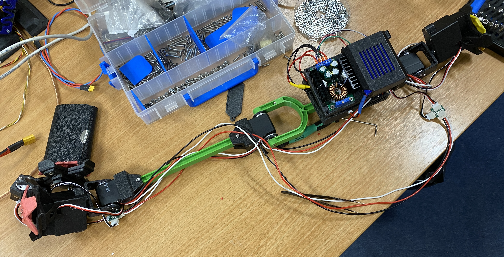

# Design and Construction of a Relative Robot for Manipulating Digital Materials

In my bachelor project I will be focusing on design and construction of a relative builder robot, that manipulates with digital
materials. Digital materials come in variety of mechanical properties, which are picked to suit given purpose. In our case of building structures we will use discrete metamaterials subunits called VOXELs. Voxels are simply "cubes" formed of 6 faces - lattices.
Those lattices can have earlier mentioned various properties, for example they can be just rigid structures keeping its shape, or they can be able to squeeze in certain directions. Voxels that I'll be using are rigid, but equiped with magnetic joints, so they can be joined together just like LEGO bricks.

## Design of the voxels

First of all I have to design my voxels. I based it on design of simple rigid voxel. I added holes for magnets and edited corner brace - when robot docks on the voxel, cross-shaped anchor has to get through lattice.
The size of the voxel is 90x90x90 mm.
Whole design is made in Fusion 360. Each lattice is 3D printed from PETG. Specific print settings: sequential printing - printer finishes first one object and than moves to another; no infill - increased number of perimeters to 5; material - PETG;
temperatures (nozzle/heat-bed) - first lr.: 230°C/85°C, other lrs.: 240°C/90°C;  layer height - 0.15 mm.  
My first printed lattice was designed to test strength of bond between two lattices. Each lattice is equiped with 4 pairs of magnets in each corner.
We have to use pairs of magnets because when we put two mirrored lattices next to each other, the polarities of the magnets have to be opposite as you can see in the picture below[^1].
 

 

Magnets are 3x3 mm (DxH) neodym cylinders, with magnetic force of 290 g, which seemed sufficient. First idea of fixing the magnets in place was to glue them in the holes (with clearence 0.3 mm),
but it would be too difficult when assembling larger number of voxels. Magnets fitted in holes perfectly.  
The updated version is designed for press-fitting the magnets. Therefore, the holes are a bit smaller with 0.1 mm offset.
 

 

## Design of the robot
The robot's design is inspired by the BILL-E[^2] robot from MIT (further NASA project ARMADAS). Inchworm type robots like BILL-E uses locomotion to move around the structure.
Front gripper is equipped with manipulator that robot uses to handle voxels. Both grippers and manipulator uses same locking system. 
Most of the parts are 3D printed from the PLA, besides the anchors, which are printed from PETG.

### Gripper Anchor
When robot gripper lands on the voxel, the robot has to attach to it. For this purpose is the gripper equipped with servo actuated anchor.
The anchor is cross-shaped to pass through the voxel lattice, when it's 45° rotated (open). Servo then turns the anchor back to its 0° position (close),
and locks the gripper in place.
 

 
I made the arms of anchor thicker (3 mm), to be more robust, when the robot leans with all its weight to it.
I also added round corners to the endings of anchor arms, so the anchor can lock in place smoothly, when its not positioned perfectly.
Another problem that I found out was that the anchor is too far from the voxel lattice, and that the gripper has wobble when locked on the voxel.
So I made multiple spacers that changes distance from motor mount, and tested them. I got best result with spacer that made the anchor to be without any tolerance.
 

 

### Rear Gripper
I derived the gripper design from my used hardware. I needed to fit in one ST3215 motor that moves the gripper around z-axis and one SC09 motor which actuates
the anchor. It consists of three parts to be easily printable: gripper cross, gripper body itself and ST servo cap. Gripper cross arms have 0.1 mm clearance from the
voxel lattice, so the gripper fits easily on the voxel, and the connection is solid enough.
 

 

### Legs
In the beginning I wanted to make hollow legs in which would fit all the electronics inside. I estimated that way length of the legs around 20 cm (axis-axis).
I tried to run simulation in Matlab using Robotics Toolbox. In MITs paper[^1] they derived the minimum length of the legs, so the robot is able to perform convex/concave
cornering move. It occurs in situation when robot is moving more than one layer of the voxels up and the joints reaches their limit angles. I wanted to simulate this
situation in Matlab, but the generated inverse kinematics didn't work as I expected. Probably because the base of the robot had offset, but I could't find a way to change it.
 

 
Nevertheless I found out that the design I wanted at first will struggle only with legs placed on the neighbouring voxels, because they were too bulky.  
Instead I decided to choose minimalistic design with H-profile shaped legs, that are robust enough and lightweight at the same time. The electronics is compactly placed in the box
attached to the rear leg. From the size of the electronics box is derived resulting length of the legs l = 24 mm (axis-axis). 
The first prototype of the rear leg was the entire leg in one part, which resulted in unsuccessful print. The second prototype was successfully printed
but it was impossible to assemble the fork of the leg with the elbow motor. Final version is divided into four parts:
the leg with left arm of the fork, right arm of the fork and two flanges for both motorized and free-spinning axis of the motor.
The front leg is simple straight extruded H-profile.

### Electronics Box
The electronics box holds all the electronics besides the motors. It is divided into four parts: the box itself, the box cap, battery box and the battery box cap.
There are some minor design issues that I will address in the future. The battery box cap doesn't fit exactly right, mounts for the smaller step-down converter are a bit misaligned,
the electronics box has to be mounted before installing the box itself, the battery box has sharp edges in the cutout for the battery cables, which damages the battery cables.
 

 

### ST Servo Leg Mount
I made several prototypes on which I tested the tolerances for the servo shaft and the shaft for the leg. In the final version the leg shaft has 0.1 mm tolerance.
The servo shaft has on the longer side about 0.4 mm tolerance and 0.15 mm on the shortes side. The mount secures the parts tight.
 

 

### Wrist Mount
The wrist mount connects the z-axis motor of the gripper to the wrist motor. Again I printed several versions where I had
to fine-tune distance between the arms that holds the wrist motor. The mounted motor tented to squeeze the arms together. The final distance is 36.7 mm, which is a little bit less than
the distance between outer flanges faces (measured 37 mm).
 

 

### Front Gripper & Voxel Manipulator
The front gripper design is derived from the rear gripper. I had to fit the SC15 mount so it can fit in the middle
of surrounding voxel structure in one layer (the structure is built layer by layer so we don't have to worry about fitting to the voxels above
current layer where the robot is located). The SC15 mount is held on the arm of the front gripper main body. It has cutout that
allows the voxel manipulator to turn up to 95° (max limit 98°). The voxel manipulator design is derived from the gripper cross. It has
arm that connects it to the SC15 arm. It was hard to design, so when it moves, it fits into tiny space between the SC15 arm and voxel
faces. It uses same locking system as the grippers.
 

 

### Whole assembly

                                                                               
## Electronics

### Raspberry Pi Zero 2W
I don't want to connect monitor to RasPi, so I will be using it in headless setup - connect via SSH. In future I am planning to run ROS2 on the controller,
so I needed more capable and powerful controller board, than basic boards like Arduino or ESP32.
The ROS2 doesn't support default Raspberry Pi OS, so I needed to run one of the newest versions of Ubuntu Server. I tried out the newest
Ubuntu Server 24.10, then the 24.04.1 LTS but none of them booted, only the Raspberry Pi OS did. Finally older version 22.04.5 LTS (Jammy) booted up,
and I could get into proper work. This version of Ubuntu is supported by Humble Hawksbill ROS2 distribution, which I probably will use.
I connected to RasPi using SSH and cloned my git repository with [Waveshare ST series servos Python library](https://www.waveshare.com/wiki/Bus_Servo_Adapter_(A)). For coding I am using VSCode remote development extension, which installs
VSCode Server version on RasPi. Then I am able to edit code on remote RasPi conveniently from my laptop.

### ST3215 Servos
I am using the Waveshare ST3215 are 30 kg.cm torque serial bus programmable servos. Thanks to half-duplex serial communication they also implement feedback
(position, rotation speed, load and input voltage), which substitutes need of any other kind of sensors on the robot.
That also implies that servos are connected in series one into another and they don't have to be connected on the drvier
board in parallel. Actuators of those properties are ideal for controlling travel motion of the robot.
The input voltage range is 6-12.6 V and they can operate in 360° rotation angle (0-4095 value).

### SC15 & SC09 Servos
SC series servos are using same serial communication as ST servos. 
Both grippers and voxel manipulator are using SC09 servos to actuate the anchor. They are small servos with torgue 2.3 kg.cm.
The input voltage range is 4.8-8.4V. They can turn in 300° (0-1023 value). 
The SC15 servos are used for rotating the voxel manipulator. They operate in 180° rotation angle (0-1023 value).
The input voltage is the same as SC09.

### Bus Servo Adapter 
The ST/SC series servos are powered and controlled via Waveshare Bus Servo Adapter (driver board). The driver board can be controlled via USB-C or UART TX/RX pins.
In use with RasPi Zero board I am using the UART option. To set the UART communication on the driver board I had to place yellow jumper caps to the A position.
Using jumper wires I connected RasPi UART GPIOs 14 (TX), 15 (RX) and 13 (GND) to the driver board pins like: TX-TX, RX-RX, GND-GND.
For first test I connected one ST servo to the driver board with 12V power supply from Li-Ion battery. In the Python library I changed the USB port to UART serial port
/dev/ttyS0. When I tried to run the ping.py demo script, which tests both direction communication between servo and Raspi. I ran into the first problem with serial port access permission denied.
So I used sudo chmod on the mentioned port device, but that solved the problem only until the next reboot. The second issue was that the ping to servo wasn't reliable. Respectively the feedback
did't work, cause when I tried to read speed and position, packets were never received. I thought that it could be caused by disturbance arising due to multiple grounds of power sources. So I soldered
wire splits, so the RasPi and the driver board are both powered from the same source, but that didn't help. 
From official [RasPi documentation](https://www.raspberrypi.com/documentation/computers/configuration.html#configure-uarts) I found out that RasPi Zero supports
two standarts of UART: mini UART (default primary), PLO11 (default secondary). The problem of the mini UART is that its baudrate is dependent on the CPU load. This is problem for higher baudrates like in my
case, the servos are set to 1 Mbd/s by default. PLO11 is more robust solution which isn't dependent on CPU load. It requires disabling Bluetooth module by adding `dtoverlay=disable-bt` line at the end of the /boot/firmware/config.txt file.
Then also disabling hciuart service, which initializes BT modem is needed: `sudo systemctl disable hciuart`. After reboot the UART communication
finally worked. Now I am using the /dev/ttyAMA0 port (default port for BT) instead of /dev/ttyS0. I solved the problem with permission denied by disabling the serial login shell: in the /boot/cmdline.txt remove text `console=serial0,115200`. 
With communication working stably I could get into setting the servos IDs. This is done by accessing the EPROM memory of the servo, and rewriting the ID value on the
`STS_ID = 5` address. Accessing the EPROM is done by using `LockEprom` and `unLockEprom` commands. The servo IDs are shown in the picture in Whole assembly section. 
Complete memory table of the addresses is saved in this branch (it is the same for both ST/SC series servos even though its listed only for SC servos).
I achieved controlling independently all five ST servos connected in series.
 

### Circuit
The whole robot is powered with 11.1 V Li-Ion battery. RasPi is powered via XL4015 step-down converter set to 5.07V output voltage (RasPi recommended power supply is 5V).
The driver board is powered by 200W with 10A maximum current supply. I set it to 8.47V (following the max. input voltage of SC servos - 8.4V). The step-down is
protected with Schottky diode wired od the OUT+ terminal from the voltage peaks that could servos generate and damage the converter.
SC servos are powered directly from the driver board. 
To achieve maximum torque also from ST servos, the power cable is connected directly to the battery.
 

## Conclusion
I achieved building prototype of the assembly robot. Through the way I found out several design choices that could be done better.
I thought that the legs couldn't be any shorter derived from the size of the electronics box. But it can overhang over the rear leg fork,
when we accept that elbow motor could not move to the obtuse angles. I found out that the 3D printed H-profiles, with their length are quite
wobbly, so in the future I will maybe substitute them with alloy profiles as I was suggested. The anchor printing quality isn't very good,
when made on the classic FDM printer. It would be more suitable to print it on the SLA printer. The SC09 included servo arms
are very cheap and they probably won't resist when bigger force will be applied to the anchor, so I would try to find metal alternative, that
is used on the ST servos.

## References
[^1]: B. Jenett, A. Abdel-Rahman, K. Cheung and N. Gershenfeld, "Material–Robot System for Assembly of Discrete Cellular Structures," in IEEE Robotics and Automation Letters, vol. 4, no. 4, pp. 4019-4026, Oct. 2019, doi: 10.1109/LRA.2019.2930486.
keywords: {Mobile robots;Robot kinematics;Robotic assembly;Path planning;End effectors;Robot sensing systems;Multi-robot systems;Assembly;space robotics and automation;path planning for multiple mobile robots or agents}
[^2]: B. Jenett and K. Cheung, “BILL-E: Robotic platform for locomotion and manipulation of lightweight space structures,” in Proc. 25th AIAA/AHS
Adapt. Struct. Conf., 2017, paper AIAA 2017-1876.

