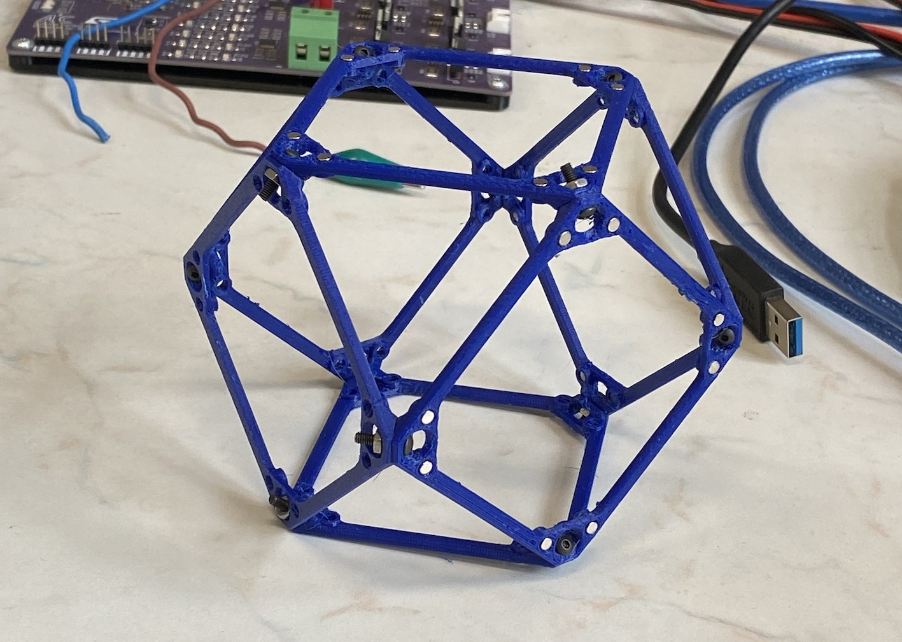

# Design and Construction of a Relative Robot for Manipulating Digital Materials

In my bachelor project I will be focusing on design and contruction of a relative builder robot, that manipulates with digital
materials. Digital materials come in variety of mechanical properties, which are picked to suit given purpose. For our purpose of building structures we will use discrete metamaterials subunits called VOXELs. Voxels are simply "cubes" formed of 6 faces - lattices.
Those lattices can have earlier mentioned various properties, for example they can be just rigid structures keeping its shape, or they can be able to squeeze in certain directions. Voxels that I'll be using are rigid, but equiped with magnetic joints, so they can be joined together just like LEGO bricks.

## Designing the voxels

First of all I have to design my voxels. I based it on design of simple rigid voxel. I added holes for magnets and edited corner brace - when robot docks on the voxel, cross-shaped anchor has to get through lattice. Whole design is made in Fusion 360. Each lattice is 3D printed from PETG. Specific print settings: sequential printing - printer finishes first one object and than moves to another; no infill - increased number of perimeters to 5; material - PETG;
temperatures (nozzle/heat-bed) - first lr.: 230°C/85°C, other lrs.: 240°C/90°C;  layer height - 0.15 mm.

### Magnetic voxel MK0

My first printed lattice was designed to test strenght of bond between two lattices. Each lattice is equiped with 4 pairs of magnets in each corner. We have to use pairs of magnets because when we put two mirrored lattices next to each other, the polarities of the magnets have to be opposite. Magnets are 3x3 mm (DxH) neodym cylinders, with magnetic
force of 290 g, which seemed sufficient. First idea of fixing the magnets in place was to glue them in the holes (with clearence 0.3 mm), but it would be too difficult when assembling larger number of voxels. Magnets fitted in holes perfectly.

### Magnetic voxel MK1

The updated version is designed for press-fitting the magnets. Therefore the holes are a bit smaller with 0.1 mm offset.

## Design of the robot

### Gripper anchor
When robot gripper lands on the voxel, the robot has to attach to it. For this purpose is the gripper equipped with servo actuated anchor.
The anchor is cross-shaped to pass through the voxel lattice, when it's 45° rotated. Servo then turns the anchor back to its base position,
and locks the gripper in place. I designed prototype which you can see on the picture below [ADD IMAGE]. I made the arms of anchor thicker,
to be more robust, when the robot leans with all its weight to it. I also added round corners to the endings of anchor arms, so the anchor
can lock in place smoothly, when its not positioned perfectly. Another problem that I found out was that the anchor is too far from the voxel
lattice, and that the gripper has wobble when locked on the voxel. So I made multiple spacers that changes distance from motor mount, and tested them.
I got best result with spacer that made the anchor to be without any tolerance.

### Gripper
The design of the gripper was quite challenging. [...COMPLETE THIS PARAGRAPH]

## Bring electronics to life

### Raspberry Pi Zero 2W
In future I am planning to run ROS2 on the controller, so I needed more capable and powerful controller board, than basic boards like Arduino or ESP.
The ROS2 doesn't support default Raspberry Pi OS, so I needed to run one of the newest versions of Ubuntu Server. I tried out the newest
Ubuntu Server 24.10, then the 24.04.1 LTS but non of them booted, only the Raspberry Pi OS did. Finally older version 22.04.5 LTS (Jammy) booted up,
and I could get into proper work. This version of Ubuntu is supported by Humble Hawksbill ROS2 distribution, which I probably will use.
I connected to RasPi using SSH and cloned my git repository with Waveshare ST series servos Python library. For coding I am using VSCode remote development extension, which installs
VSCode Server version on RasPi. Then I am able to edit code on remote RasPi conveniently from my laptop.
